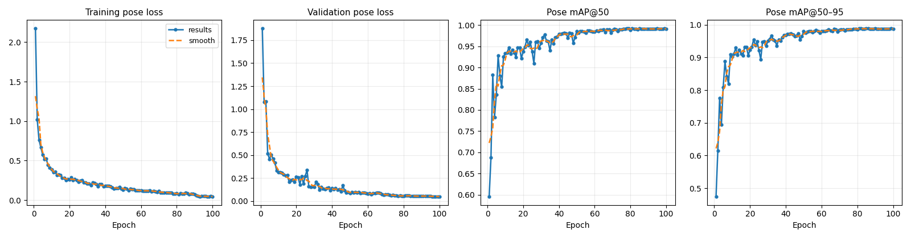

# Dial Gauge Reading Pipeline (YOLOv8 Pose + OCR)
This project builds a practical workflow for extracting dial gauge readings from images.
It combines:
- YOLOv8 pose training and inference for pointer/keypoint detection
- Semi-automatic per-image zero/reference calibration
- Geometric conversion from pointer angle to displacement
- OCR extraction of temperature and timestamp overlays
## Project Structure
- `train_yolo.py`: trains a YOLOv8 pose model and evaluates on test split
- `predict_yolo.py`: runs inference on a folder of images and exports `pose_predictions.csv`
- `semi_auto_zero_tracking.py`: interactive tool to set `CENTER` and `ZERO_PT`
- `readings_out_value.py`: computes angle and displacement (`value_mm`) from keypoints + calibration
- `ocr_temperature_datetime.py`: OCR pipeline for extracting temperature/datetime from image overlays
- `data/`: utility scripts and dataset files
  - `data/yolo_pose_dataset/dial_pose.yaml`: YOLO dataset config
  - `data/dial_crops.py`: crop helper for raw images
  - `data/data_blur.py`, `data/data_fog.py`: augmentation generators for robustness testing
  - `data/info.py`: manual single-image center/zero annotation helper
- `Results/`: output directory for training runs, inference CSVs, visualizations, and OCR exports
## Environment Requirements
- Python 3.9+ (recommended)
- Windows (current scripts use Windows-style paths and bundled OCR executable)
- Optional GPU (CUDA) for faster YOLO training/inference
Python packages used in scripts:
- `ultralytics`
- `torch`
- `opencv-python`
- `pandas`
- `numpy`
- `Pillow`
- `matplotlib`
- `tqdm`
- `pytesseract`
- `openpyxl` (for Excel export)
Install with:
```bash
pip install ultralytics torch opencv-python pandas numpy Pillow matplotlib tqdm pytesseract openpyxl
```

## Visualization Example

### Loss Curve


### Dial Gauge Recognition Example

